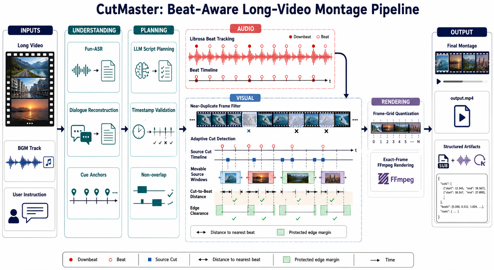

# CutMaster

<p align="center">
  <a href="README.md"><kbd>中文</kbd></a>
  &nbsp;|&nbsp;
  <a href="README_EN.md"><kbd>English</kbd></a>
</p>

<p align="center">
  
</p>

<p align="center"><em>CutMaster: Beat-aware pipeline for long-video montage generation</em></p>

CutMaster is a backend-only pipeline for turning one long source video, one BGM
track, and a natural-language instruction into a frame-accurate music montage.
It extracts and extends the production flow used by the Mashup-Benchmark
NarratoAI adapter as an independent Python project.

CutMaster currently performs subtitle-guided content selection, LLM-assisted
dialogue reconstruction, beat-aware duration planning, source-window refinement
against visual cuts, and deterministic FFmpeg rendering. Source audio is muted
in the final video; only the selected BGM is retained.

## Pipeline

```text
source video + BGM + instruction
  -> validate inputs and protect an existing output unless --overwrite is set
  -> reuse a supplied/cached SRT or transcribe with DashScope Fun-ASR
  -> reconstruct complete dialogue sentences in parallel while preserving cue anchors
  -> generate and validate a non-overlapping, timestamped source-selection script
  -> detect BGM beats with librosa and repeat beat timestamps if the BGM loops
  -> adapt clip durations and snap output boundaries to nearby beats on the output frame grid
  -> detect internal source cuts in every candidate window in parallel
       - discard near-duplicate frames before adaptive scene detection
       - preserve original source timestamps for every retained frame
       - search each source window up to 2 seconds forward
       - minimize the worst distance from retained internal cuts to BGM beats
       - prefer at least 1 second between internal cuts and clip boundaries
  -> render every clip to an exact output-frame count
  -> concatenate normalized video-only clips
  -> loop and fade the BGM, keeping source audio muted
  -> output.mp4 + structured intermediate artifacts
```

### Dialogue reconstruction

Fun-ASR output is initially divided into short subtitle cues. CutMaster groups
adjacent cues from the same speaker into candidate passages and asks the text
model which complete passages should be merged. The requests are processed in
parallel according to `llm.max_concurrency`.

`dialogues.json` stores both the reconstructed sentence range and every original
cue-level anchor. `dialogue_merged.srt` is the sentence-level subtitle passed to
script generation. Dialogue reconstruction disables model thinking because it
is a constrained boundary-selection task.

### Script generation and beat alignment

Script generation enables model thinking and requests exactly
`ceil(target_duration / target_shot_length)` clips by default. Every returned
range must:

- overlap the supplied subtitle timeline;
- contain a non-empty picture description;
- avoid every other selected range;
- use a valid source timestamp.

The complete API request, JSON parsing, and semantic validation transaction is
retried with exponential backoff. A malformed response is never accepted as a
partial script.

CutMaster uses `librosa.onset.onset_strength` and
`librosa.beat.beat_track` to find BGM beats. Planned output boundaries are
snapped to nearby beats and then quantized to the configured output frame grid.
If the BGM is shorter than the target video, its beat timestamps are repeated in
the same way the renderer loops the BGM.

### Visual-cut refinement

For each selected source range, CutMaster detects internal visual cuts over the
range plus a two-second forward search margin. Detection uses PySceneDetect's
`AdaptiveDetector` with these current defaults:

- adaptive threshold: `2.0`;
- minimum content value: `15.0`;
- minimum scene length: `0.25s`;
- near-duplicate frame threshold: grayscale mean absolute difference `< 1.0`.

The duplicate-frame filter is important for 50/60 fps material produced from a
lower frame rate. Without it, alternating duplicate/new frames can make the
adaptive detector treat ordinary motion as dozens of false cuts. Filtering only
changes which frames participate in detection; all retained frames keep their
original source timecodes.

Candidate starts are evaluated on the source-video frame grid from the original
start through `+2s`. The minimax objective first minimizes the largest distance
between any internal output cut and its nearest BGM beat, then prefers the
smallest forward shift and fewer internal cuts.

The preferred edge clearance is `1.0s`. If no candidate window is feasible,
CutMaster tries `0.75s`, `0.5s`, `0.25s`, and finally `0.0s`. Any relaxation is
recorded in `script_adapted.json` and emitted as a warning. The `0.0s` tier is a
last-resort completion path, not a normal target.

### Frame-exact rendering

Every adapted clip has an `output_frame_range`. FFmpeg renders exactly that many
frames at the configured resolution and FPS, without source audio. Clips are
concatenated without changing the planned timeline, then the BGM is looped,
trimmed to the exact montage duration, faded out, and encoded as AAC.

Encoder selection with `render.encoder = "auto"` is:

1. `h264_videotoolbox` on macOS when available;
2. `h264_nvenc` when available;
3. `libx264` otherwise.

## Requirements

- Python `3.12` (`>=3.12,<3.13`)
- `uv`
- FFmpeg with `ffmpeg` and `ffprobe` on `PATH`
- a DashScope API key for the default LLM and Fun-ASR configuration

Python 3.13 is intentionally excluded because the librosa/Numba beat-tracking
path used here is not stable in that environment.

## Installation

```bash
uv sync
cp config.example.toml config.toml
```

`config.toml` is ignored by Git. The loader accepts either a key stored directly
as `api_key` or the name of an environment variable stored as `api_key_env`.
For environment-based configuration, replace the `api_key` entry in both
`[llm]` and `[asr]` with:

```toml
api_key_env = "DASHSCOPE_API_KEY"
```

Then export the key before running CutMaster:

```bash
export DASHSCOPE_API_KEY="..."
```

## Configuration

### `[llm]`

| Key | Purpose | Default in example |
| --- | --- | --- |
| `model` | OpenAI-compatible text model | `qwen3.7-plus` |
| `base_url` | OpenAI-compatible API base URL | DashScope compatible-mode URL |
| `api_key` / `api_key_env` | Direct credential or environment-variable name | placeholder |
| `temperature` | Sampling temperature | `0.1` |
| `max_tokens` | Maximum completion tokens | `4000` |
| `timeout_sec` | Timeout for one model request | `180` |
| `max_retries` | Retries after the first request | `3` |
| `max_concurrency` | Parallel dialogue-reconstruction batches | `4` |

The OpenAI SDK's own retries are disabled. CutMaster owns the full
request/parse/validate retry cycle, so `max_retries = 3` means at most four
complete attempts with `1s`, `2s`, and `4s` delays.

### `[asr]`

| Key | Purpose | Default in example |
| --- | --- | --- |
| `backend` | ASR backend; currently only `bailian` | `bailian` |
| `api_key` / `api_key_env` | Direct credential or environment-variable name | placeholder |
| `reuse` | Reuse a non-empty `source.srt` and extracted ASR audio | `true` |
| `timeout_sec` | Overall asynchronous ASR timeout | `1800` |
| `poll_interval_sec` | ASR task polling interval | `2` |
| `max_chars` | Preferred maximum characters per initial subtitle cue | `20` |
| `max_subtitle_duration_sec` | Preferred maximum initial cue duration | `3.5` |

Fun-ASR runs with speaker diarization enabled. Before upload, FFmpeg extracts a
16 kHz mono `source_audio.m4a` file.

### `[render]`

| Key | Purpose | Default |
| --- | --- | --- |
| `width`, `height` | Output canvas | `1920×1080` |
| `fps` | Output frame rate and timeline grid | `30` |
| `encoder` | FFmpeg video encoder or `auto` | `auto` |
| `threads` | Source-cut workers and libx264 threads | `8` |
| `bgm_volume` | Final BGM volume multiplier | `0.3` |
| `original_volume` | Source-audio volume; frame-exact mode requires `0` | `0.0` |
| `audio_sample_rate` | Final AAC sample rate | `48000` |

`threads` is a per-process setting, not a machine-wide concurrency limit.
Running multiple CutMaster processes multiplies video decoders and memory use.
For example, five outer processes with `threads = 8` can create up to 40
concurrent source-cut workers.

## Usage

```bash
uv run cutmaster run \
  --video /path/to/source.mp4 \
  --audio /path/to/bgm.mp3 \
  --prompt "Create a montage of every decisive goal" \
  --output-dir outputs/demo \
  --target-duration 60 \
  --target-shot-length 4 \
  --prompt-type event
```

All `run` options:

| Option | Required | Description |
| --- | --- | --- |
| `--video PATH` | yes | Long source video |
| `--audio PATH` | yes | BGM track |
| `--prompt TEXT` | yes | Montage instruction |
| `--output-dir PATH` | yes | Artifact and output directory |
| `--config PATH` | no | TOML config; defaults to `config.toml` |
| `--subtitle PATH` | no | Existing SRT; bypasses Fun-ASR |
| `--target-duration SEC` | no | Target output duration; default `60` |
| `--target-shot-length SEC` | no | Nominal clip duration; default `4` |
| `--prompt-type TYPE` | no | Metadata supplied to script generation; default `event` |
| `--video-title TEXT` | no | Human-readable source title supplied to the model |
| `--custom-clips N` | no | Override the calculated clip count |
| `--max-clip-duration SEC` | no | Hard cap applied during duration adaptation |
| `--overwrite` | no | Replace an existing run output |

An existing `output.mp4` causes the run to stop unless `--overwrite` is passed.
With `--overwrite`, cached ASR artifacts may still be reused when `asr.reuse` is
enabled; downstream dialogue, script, cut optimization, and render artifacts are
regenerated.

## Output artifacts

Each output directory contains:

| Path | Contents |
| --- | --- |
| `source.srt` | Supplied, cached, or Fun-ASR-generated source subtitles |
| `source_audio.m4a` | 16 kHz mono ASR input; created only when transcription is needed |
| `dialogues.json` | Reconstructed sentences, merge operations, and original cue anchors |
| `dialogue_merged.srt` | Sentence-level subtitles used for script generation |
| `script_raw.json` | Validated LLM-selected, non-overlapping source ranges |
| `script_adapted.json` | Frame-grid output ranges, beat alignment, refined source ranges, and cut diagnostics |
| `clips/clip_XXXX.mp4` | Normalized, video-only intermediate clips |
| `montage.mp4` | Concatenated video-only montage before BGM mixing |
| `output.mp4` | Final montage with looped/faded BGM and muted source audio |
| `result.json` | Final paths, durations, clip counts, wall time, and per-stage timings |
| `cutmaster.log` | INFO/DEBUG backend execution log |

Each `script_adapted.json` item adds:

- `output_timestamp` and `output_frame_range`;
- the final refined source `timestamp`;
- detected source/output cut timestamps;
- initial and optimized maximum beat distance;
- source shift, edge-clearance fallback level, and effective clearance.

## Package layout

- `asr.py`: audio extraction, DashScope upload, asynchronous Fun-ASR polling,
  diarized subtitle conversion, and ASR reuse.
- `dialogue.py`: candidate passage construction, parallel LLM boundary
  selection, sentence reconstruction, and cue-anchor preservation.
- `llm.py`: OpenAI-compatible client and full JSON transaction retries.
- `beats.py`: librosa onset-envelope and dynamic-programming beat tracking.
- `script.py`: script prompting, validation, overlap checks, duration planning,
  frame-grid quantization, and beat alignment.
- `cuts.py`: duplicate-frame-aware PySceneDetect analysis and parallel,
  forward-only frame-level minimax source-window refinement.
- `renderer.py`: encoder selection, frame-exact clip rendering, concatenation,
  and final AAC BGM mixing.
- `pipeline.py`: end-to-end orchestration, validation, timing, and result output.
- `cli.py`: command-line entry point.

## Scope and limitations

- Selection is subtitle-guided. Visually important events with no useful nearby
  dialogue are harder for the current script generator to retrieve.
- One run accepts one source video and one BGM track.
- Source audio is intentionally muted; `original_volume > 0` is rejected by the
  frame-exact renderer.
- The project does not include a UI, web queue, TTS, narration subtitles,
  stock-material search, or benchmark-specific run records.
- CutMaster does not import or require NarratoAI at runtime.

## Verification

```bash
uv run pytest
uv run python -m cutmaster --help
uv run python -m cutmaster run --help
```

## Attribution

The initial workflow is derived from the MIT-licensed NarratoAI project. See
`THIRD_PARTY_NOTICES.md` and `LICENSE`.
